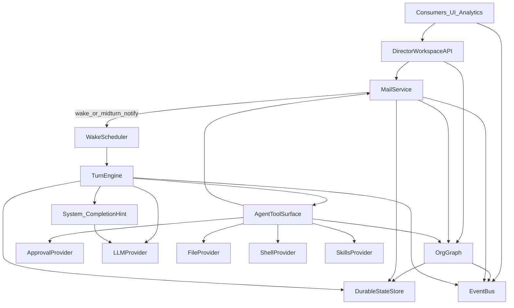
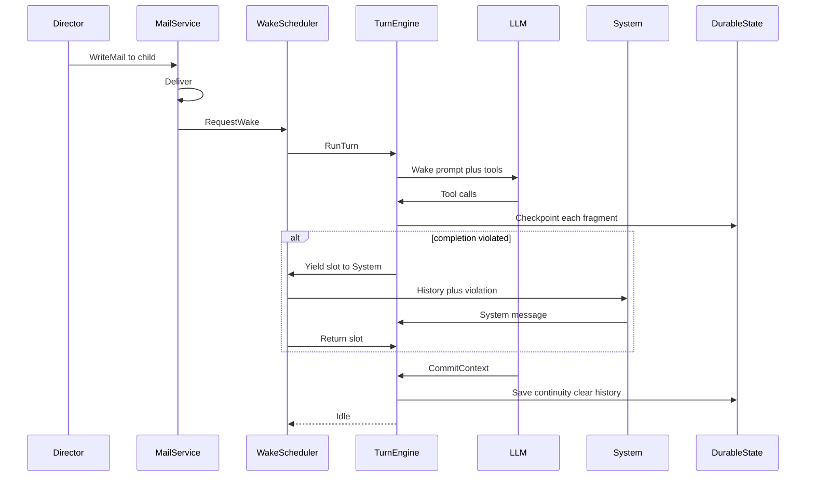

# Спецификация продукта Assistant

Документ нормирует **каркас** (протокол узлов, почты, хода, провайдеров, слотов, восстановления). Конкретные role skills, орг-конвенции (`wiki/`, `todo/`, seed Secretary) и конкретный UI — **сменный профиль**: они описаны в том же файле, но не являются критерием соответствия ядру.

Текущая реализация (.NET, Terminal.Gui, LiteDB, OpenAI-compatible LLM) — референс, не часть требований Core.

---

## 0. Как читать документ

| Слой | Статус | Содержание |
|------|--------|------------|
| **Core** | MUST для аналога | §§1–3, 5–6 (каркас) |
| **Secondary** | Informative / seed profile | §4 (Director IA референса), §7 (skills и орг-конвенции) |
| **Reference** | Трассировка к репо | §8 |

Реализация только с каркасом (без Archivist/wiki/конкретного TUI) = **Assistant Core**. Референс реализует Core + secondary-профиль.

---

## 1. Вводная (Core)

### 1.1 Что это

**Assistant** — local-first multi-agent операционная среда для одного человека (**Директора**). Директор и LLM-агенты образуют **дерево** и общаются только через **почту**. Свободный текст модели — не канал доставки: он лишь логируется. Непрерывность между пробуждениями — через continuity handoff и принудительную очистку истории после commit.

### 1.2 Какую задачу решает

Один длинный чат с одним агентом плохо масштабируется:

- контекст смешивает роли и забивается историей;
- нет явного делегирования и жизненного цикла исполнителей;
- после перезапуска память теряется или раздувается без структуры.

Assistant даёт **жёсткий каркас** (иерархия, почта, ход, handoff, провайдеры) и **динамическое поведение** поверх него (skills, политики апрува, FS/shell, содержимое ролей).

### 1.3 Метафора

| Роль | Суть |
|------|------|
| **Director (Human)** | Человеческий корень. Пишет/читает почту, наблюдает события, force-dispose ветвей. |
| **LLM-агент** | Узел дерева. Работает ходами по пробуждению почтой. |
| **Почта** | Единственный социальный канал между узлами. |
| **Система** | Stateless LLM-помощник завершения хода: при нарушении протокола завершения формулирует системное сообщение застрявшему агенту. |
| **Шина событий** | Лог случившегося для подписчиков (UI, аналитика, аудит) — не канал апрува и не чат. |

### 1.4 Границы scope (продуктовый контур референса)

**Типично входит в продукт на базе Core:**

- single-user, local-first;
- дерево LLM-агентов + один Human;
- почта, org-управление, провайдеры skills / FS / shell / approval;
- LLM по OpenAI-compatible HTTP API.

**Сознательно вне обязательного Core:**

- multi-user / SaaS / обязательный конкретный UI toolkit;
- OAuth / multi-tenant;
- обязательный MCP;
- конкретные тексты skills и layout wiki/todo;
- hard-stop / таймауты хода (могут быть в реализации, Core их не требует).

---

## 2. Доменная модель и инварианты (Core)

### 2.1 Узлы организации

| Поле | Назначение |
|------|------------|
| Имя | Стабильный квалификатор узла в addressable-наборе; для агентов **единственный** способ ссылаться на участников (отдельных node id в tool-контракте нет). |
| Описание | Стабильная специальность («кто это»). |
| Инструкции | Характер / standing aspirations — не задание текущего хода. |
| Родитель / дети | Дерево. У Human родителя нет. |
| Вид runtime | `Human` или `Llm`. |
| Inbox | Письма, ещё не снятые с узла. |
| Continuity | Одна мутирующая handoff-запись (может отсутствовать). |

**Инварианты:**

1. Ровно один человеческий корень (Director).
2. LLM-узел всегда имеет родителя.
3. Dispose узла удаляет **всё поддерево**.
4. Писать и dispose можно только **прямым** детям (и писать родителю). Внук не addressable и не увольняется отдельно — только вместе с ветвью прямого ребёнка.
5. Наблюдаемость глубже дерева (кто Running / куда ушёл inference) **допустима** и не является коммуникацией.

### 2.2 Уникальность имён при spawn

При `SpawnSubagent(name)` имя запрещено, если совпадает с именем:

- родителя вызывающего, или
- самого вызывающего, или
- любого **прямого** ребёнка вызывающего.

Внуки и предки выше родителя в коллизию **не** входят. Одинаковые имена в разных ветках допустимы: у каждого узла свой addressable-набор.

Поле `parentRole` **отсутствует**: ребёнку достаточно имени родителя.

### 2.3 Адресность почты

Узел может писать **только** родителю и прямым детям (включая Director). Иное — ошибка протокола («не addressable»).

**Продуктовый закон:** нет писем через поколение. Иначе предок вмешивается во внутренности потомка, и continuity ребёнка устаревает без его ведома.

### 2.4 Письмо

| Поле | Назначение |
|------|------------|
| Id | Короткий уникальный id в системе (монотонная последовательность допустима). |
| From / To | **Имена** участников. |
| Subject / Body | Тема и тело. |
| Timestamp | UTC. |
| Status | Как минимум: новое (NEW) / прочитанное. |

Отдельного Thread/threadId в Core **нет** (пережиток старой модели all-to-all).

**Жизненный цикл во входящих получателя:**

| Действие | Эффект |
|----------|--------|
| Доставка | Письмо в inbox; для LLM-получателя — событие wake (см. §2.8). |
| `ReadMail` | Полное тело; снимает NEW; письмо **остаётся** в inbox. |
| `ReplyMail` | Ответ автору по id исходного; исходное **снимается** с inbox. |
| `ResolveMail` | Закрытие транзакции **без** ответа отправителю; письмо снимается с inbox; отправитель **не** уведомляется. |
| `WriteMail` | Новое письмо addressable получателю; **не** снимает чужие входящие. |
| Dispose ребёнка (после правил §2.6) | Purge писем этого поддерева из inbox родителя. |

Историю переписки после ухода письма из inbox Core **не** хранит. Аудит — через подписку на шину.

### 2.5 Spawn ≠ assign

`SpawnSubagent` создаёт только **identity (метаданные личности)**. Задание — отдельным `WriteMail`.

**Литмус** для description / instructions: текст уместен, если следующему письму дадут *другую* задачу?

- Да → identity.
- Нет → brief в письмо.

### 2.6 Dispose

**Агент** не может dispose ребёнка, пока в его inbox есть **непрочитанное** письмо от этого ребёнка. Сначала `ReadMail`. После Read dispose допустим; почта поддерева у родителя purge — законный способ закрыть ветку без текстового ответа ребёнку (когда работа устроила, а identity/состояние ребёнка больше не нужны).

**Human (Director)** dispose прямого ребёнка — **force (sigkill)**: без Read-проверок, с отменой Running-хода, с потерей прогресса всей ветви. Админский выход из зависания.

### 2.7 Ход LLM-узла (turn)

Единица работы — **ход**, обычно стартующий по доставке почты.

**Фазы (контракт):**

```
Wake (правила игры + continuity? + заголовки почты)
  → работа с инструментами / почтой
  → пока условия завершения хода не выполнены: подсказка Системы / повтор
  → CommitContext (когда разрешён)
  → история модельного диалога очищена; continuity сохранена
```

**Коммуникация за ход** — успешный `WriteMail` или `ReplyMail`.  
`ResolveMail`, `DisposeSubagent`, `ReadMail` коммуникацией **не** являются.

**Предикат `AllowContextCommit`:**

```
AllowContextCommit ⇔ (была коммуникация за ход) ∨ (inbox пуст)
```

Смысл: статически «достигнута ли цель» непроверимо; прокси — осязаемая отправка. Пустой inbox после одних Resolve — допустимый уход в сон (нечего протолкнуть). Если висит родительский brief, одних Resolve отчётов детей недостаточно — нужна коммуникация (иначе дедлок распространения работы вверх).

**Инварианты хода:**

1. Свободный текст модели **никому не доставляется**; только логируется. Внешний ответ — mail tools.
2. `CommitContext` при ложном предикате — **мягкая** ошибка; история сохраняется; далее может сработать Система.
3. `CommitContext` требует непустой continuity note.
4. После commit история очищена; на следующем wake continuity показывается только если запись есть (пустой/отсутствующий блок не пишется).
5. Письма, пришедшие **во время** Running, не стартуют второй ход того же узла: mid-turn notification в текущий контекст (экономия ходов).

### 2.8 Пробуждение (wake)

**Триггер:** событие **доставки** входящего письма LLM-узлу (не «inbox непуст после Idle»). Старые незакрытые письма сами по себе re-wake не запускают — иначе невозможно «отправил отчёт и ждёт ответа», оставляя brief во входящих.

**Планировщик:**

1. На LLM-узел — не более одного Running-хода (CAS begin-run).
2. Глобальный лимит параллельных агентных слотов: `MaxConcurrentAgentRuns` (Core-конфиг).
3. Несколько wake до старта coalesce’ятся.
4. Human не планируется LLM-ходом; реактивен через своих потребителей API/UI.
5. Пустой inbox на старте обычного wake — ошибка инварианта. Resume mid-turn — отдельный путь без нового wake-prompt.

**Wake-prompt (MUST-темы, короткий ориентир):**

1. **Правила игры:** жизненный цикл хода и устройство коммуникации (outbound только mail tools; снятие писем Reply/Resolve/dispose; предикат commit; addressability; spawn≠assign; после CommitContext история очистится). Без отдельного акцента «thinking приватен» — достаточно «свободный текст не доставка».
2. **Continuity** — только если запись есть; иначе блок опускается.
3. **Заголовки ожидающей почты** — id, time, from, subject, статус (экономия ходов на List/Read вслепую).

Цель wake — сразу сориентировать и дать работать, не портянка.

### 2.9 Continuity handoff

Briefing для **будущего себя**, не транскрипт и не приказ другому.

Рекомендуемые секции (заполнять применимое): Intent; Progress; Decisions & dead ends; Active thread; Carry forward.

Правила: load-bearing факты; не выдумывать прогресс; не перечислять inbox; недоставленное — только через Write/ReplyMail. Размер в Core не лимитируется (дисциплина skills/практики). Одна запись на узел; overwrite при commit.

### 2.10 Система (завершение хода)

Кодовое «support» = **Система**: stateless LLM-вызов при нарушении завершения хода.

**Вход:** копия локальной истории застрявшего хода + описание нарушения + встроенный system-prompt Системы (мотивирует оповестить застрявшего и предложить выход).

**Выход:** системное сообщение в текущий ход застрявшего агента.

**Ограничения:** без tools, без собственной session.

**Слоты:** Система занимает `MaxConcurrentAgentRuns` на общих основаниях. Чтобы не дедлочить с застрявшим: на время вызова Системы слот **принудительно отбирается** у застрявшего агента, отдаётся Системе, затем **возвращается** исходному агенту.

**Лимитов** числа вызовов Системы за ход Core **не** требует. Hard-stop хода Core не требует; админский выход — Human force-dispose ветки (по наблюдению событий).

### 2.11 Approval Provider

Перед вызовом **не-core** инструмента runtime запрашивает сменный **Approver**: `RequestApproval(agent, action, payload) → Allow | Deny(reason)`.

| Сейчас (профиль) | Always-allow (auto-approve) |
|------------------|-----------------------------|
| Контракт | Заменяем реализацию (ручной UI, правила, внешний менеджер) без смены Core |

**Семантика:**

- Пока ждём решения — агент остаётся в том же ходе, **слот не освобождается**.
- Timeout ожидания в Core **нет** (может быть в реализации апрувера).
- Deny — мягкий: tool result с **причиной**; ход продолжается; модель может сменить план или запросить человека почтой.
- Апрувы **не** живут на шине событий; это отдельный порт. Шина — только факты случившегося.

**Core tools (без approve):**

- Mail: `GetRecipients`, `ListInbox`, `ReadMail`, `WriteMail`, `ReplyMail`, `ResolveMail`
- Org: `SpawnSubagent`, `DisposeSubagent`
- Turn: `CommitContext`
- Skills: `LoadSkill`

**Через Approver:** FS, Shell и любые прочие не-core tools.

### 2.12 Провайдеры capabilities

Core фиксирует **порты**, не одну политику на всех:

| Провайдер | Смысл |
|-----------|--------|
| Skills | capacity загрузить playbook по имени; enablement/path — конфиг |
| FS | доступ к файлам в рамках выданных агенту корней/политик |
| Shell | исполнение в рамках политики провайдера |
| LLM | chat/completions streaming (OpenAI-compatible — референс) |
| Approver | §2.11 |

**Упрощение текущего профиля:** всем агентам общий shared root. Это не догма Core: later per-agent roots/capabilities без переписывания протокола почты/хода.

Конкретный deny-list команд — не текст Core; задаётся провайдером/конфигом.

### 2.13 Персистентность и restore

**Durable в Core:** узлы (identity, continuity, флаги незавершённого хода), inbox, сериализованный контекст незавершённого хода (session), meta (например счётчик mail id). **Без** schemaVersion и без нормированных миграций.

**Checkpoint:** после каждого значимого фрагмента шага (подумал → tool → подумал → mail …). Crash → restore с последнего checkpoint → **продолжить** тот же ход (resume без нового wake-prompt, если ход не был закоммичен).

**Prune orphans при старте — нет.** Очистка только явным dispose. Битый/нечитаемый store — **критическая ошибка** старта (на неё нельзя «повлиять» из протокола).

История переписки вне inbox не хранится. События шины не персистятся и не кешируются Core. Размер session/continuity в Core не лимитируется.

### 2.14 Шина событий

Внутрипроцессная публикация фактов: org, turn, thinking (stream), mail, tools, errors, online/busy и т.п. Подписчики строят UI, аналитику, внешний аудит. Апрувы сюда не входят (§2.11).

---

## 3. Архитектура (Core)

### 3.1 Компоненты



### 3.2 Слои

| Слой | Делает | Не делает |
|------|--------|-----------|
| Consumers | UI / аналитика / другие sink’и | Обязаны быть TUI |
| Director Workspace API | Операции Human-корня + нотификации | Виджеты |
| Org Graph | Identity, дерево, busy/idle, dispose subtree | Провайдер LLM |
| Mail Service | Адресность, доставка, read/reply/resolve/purge, wake/notify | Запуск модели |
| Wake Scheduler | Coalesce, слоты, turn/resume, передача слота Системе | Парсинг skills |
| Turn Engine | State machine хода, tools, checkpoint | Персист в обход store |
| Approval Provider | Allow/Deny(reason) для не-core tools | Шина как транспорт |
| System | Stateless hint при нарушении завершения | Tools/session |
| Durable State | Граф, mail, sessions, continuity | Версии схемы / миграции |
| Event Bus | Fan-out случившегося | Апрувы, блокировка продьюсеров на UI |

### 3.3 Оркестрация



### 3.4 Инструментальный контракт (сводка)

См. §2.11. Дополнительно:

| Инструмент | Контракт |
|------------|----------|
| GetRecipients | Addressable: parent + direct children (имя, описание, флаг parent). |
| ListInbox | Заголовки. |
| ReadMail | Тело по id; снимает NEW. |
| WriteMail | Новое письмо; коммуникация. |
| ReplyMail | Ответ по id; снимает исходное; коммуникация. |
| ResolveMail | Закрыть без ответа; снимает; не коммуникация. |
| SpawnSubagent | Identity only; проверка уникальности имён §2.2. |
| DisposeSubagent | С правилом Read-before-dispose для агентов. |
| CommitContext | По предикату §2.7; непустой handoff. |
| LoadSkill | Playbook по имени. |
| FS / Shell | Через провайдеры + Approver. |

Standing bootstrap агента фиксирует протокол (согласованно с wake): почта, spawn≠assign, commit/continuity, наличие FS/shell/skills по конфигу.

### 3.5 Конфигурация (Core-релевантное)

| Параметр | Смысл |
|----------|-------|
| LLM: key / endpoint / model / timeout | Доступ к модели |
| MaxConcurrentAgentRuns | Глобальные слоты ходов (+ логика уступки Системе) |
| Skills enablement / path | Провайдер skills |
| FS/Shell policies | Провайдеры capabilities |
| Approver binding | AutoApprove или иная реализация |
| State path | Durable store |
| Agent templates / seed / UserDescription | **Secondary** (инициализация), не критерий Core |

Настройки — вне обязательного in-app settings UI.

### 3.6 Заменяемость потребителей

Ядро работает через: lifetime, event bus, Director Workspace API. Любой consumer (TUI, GUI, headless, аналитика) допустим.

---

## 4. UX референса (Secondary)

Не критерий соответствия Core. Информационная архитектура референсной консоли и сценарии. Toolkit не фиксируется.

### 4.1 Метафора UI

- **Agents** — прямые дети Директора (hire/fire/write); глубже дерева — наблюдаемость busy/inference.
- **Inbox** — почта Директора.
- **Log** — подписчик шины (thinking, tools, errors, org) — не чат.

### 4.2 IA

Два режима: Workspace (Agents | Inbox) и полноэкранный Log. Вкладки — стек list→overlay. Старт: Workspace → Agents.

### 4.3 Экраны (инвентарь)

Shell+status; Agents list; Compose; Spawn template/custom; Inbox list/detail; Reply compose; Log.

Dispose/Delete в UI Директора: Human force-dispose без confirm — продуктовый выбор референса; `ResolveMail` у агентов ≠ «delete» в UI человека (человек может снимать письма со своего inbox как оператор — ответственность на человеке).

### 4.4 Сценарии

Первый запуск / назначить работу / нанять-уволить / наблюдать Log — как в референсе; детали shortcut’ов informative.

### 4.5 Визуальный язык и a11y

Референс TUI: keyboard-first, UTF-8, контраст selection, wrap Log при resize. Screen reader / mobile — вне scope референса.

---

## 5. Нефункциональные требования (Core)

### 5.1 Local-first

Состояние org/mail/sessions/continuity переживает перезапуск через checkpoint. Один пользователь на установку в типовом профиле.

### 5.2 Параллелизм

`MaxConcurrentAgentRuns`; UI/consumers не блокируются на ходе (события). Mid-turn mail не создаёт второй ход. Система временно перехватывает слот (§2.10).

### 5.3 Надёжность протоколов

Нарушения addressability / commit-предиката / пустой handoff / dispose при unread — предсказуемые ошибки инструменту. Resume mid-turn после краша — MUST. Hard-stop — не требуется Core.

### 5.4 Безопасность

- Секреты LLM вне агентного канала и обычного mail.
- Границы FS/Shell — провайдер + Approver.
- Нет multi-tenant требований в Core.

### 5.5 Наблюдаемость

Шина событий; usage/duration желательны, если провайдер отдаёт.

### 5.6 i18n

Не требуется framework в Core; язык UI/skills — профиль.

---

## 6. Критерии приёмки Core

Реализация соответствует Core, если:

1. Доставка письма LLM-узлу будит ход; повторная доставка mid-turn не создаёт второй ход.
2. Addressability: только parent + direct children; через поколение — ошибка.
3. Spawn создаёт только identity; задание — отдельным письмом.
4. Свободный текст модели не доставляется получателям (только лог).
5. Письмо снимается с inbox только Reply / Resolve / purge при dispose.
6. `CommitContext` разрешён ⇔ коммуникация за ход ∨ inbox пуст; иначе мягкий отказ.
7. При нарушении завершения хода Система получает историю+violation, занимает слот с уступкой, возвращает системное сообщение; слот возвращается агенту.
8. Wake содержит правила игры, заголовки почты, continuity только при наличии.
9. Checkpoint на фрагментах шага; после краша — resume с checkpoint.
10. Нет prune orphans; Human dispose = force всей ветви.
11. Не-core tools идут через Approver; core-список §2.11 — без approve.
12. Имена: уникальность §2.2; агенты адресуют по именам; Thread в модели нет.
13. Потребители (UI и др.) могут строиться только на API + шине, без вшивания toolkit в ядро.
14. Secondary-профиль (конкретные skills/UI) может отсутствовать без потери соответствия Core.

---

## 7. Secondary-профиль: skills и орг-конвенции

Не MUST Core. Референсная «компания» и playbooks. Тексты skills на диске — источник поведения профиля; при расхождении с этим разделом для **профиля** предпочтителен актуальный skill-файл, для **Core** — §§1–3.

### 7.1 Cold start (конфиг)

Не ядро: настройка начального состояния. Типично: зарегистрировать Human (Director); опционально заспавнить шаблон `[0]` (Secretary) как прямого ребёнка.

### 7.2 Shared workspace layout (упрощение)

Общий root для агентов (пока). Конвенции референса:

| Область | Владелец профиля | Назначение |
|---------|------------------|------------|
| `todo/` | менеджер (Secretary) | Операционный список Директора |
| `wiki/` | Archivist | Markdown knowledge base |
| `skills/` | дистрибутив/конфиг | Role playbooks |

### 7.3 Brief (дисциплина профиля)

Письмо-задание: WHAT (цель, входы, ограничения, DoD, что вернуть), не HOW. Методы — в skill ребёнка. После briefing менеджер останавливается.

### 7.4 Secretary

Зона: route/staff, declarative brief, QC skim, ответ Директору, todo/, dispose. Не зона: craft, wiki, загрузка craft-skills. Wiki — через Archivist. Todo — исключение: ведёт сам.

### 7.5 Subagent management

Hire при нужде в отдельном плане/craft/фокусе. Только прямые дети. Brief самодостаточен. Dispose без courtesy ACK, если работа закрыта.

### 7.6 Knowledge wiki (Archivist)

Layout: `index.md`, `log.md`, `intakes/`, `entities/`, `concepts/`, `synthesis/`, опционально `AGENTS.md`. Правила: markdown only; index при структурных изменениях; append-only log; provenance; не изобретать факты; thin batch → thin pages. Операции: archive, query, lint.

### 7.7 Todo

```
todo/
  TODO.md
  archive/
    YYYY-MM-DD.md
```

Открытые: `- [ ] task | optional meta`. Done → archive дня. Cancel → удалить без архива.

### 7.8 Known hire — Archivist

Рецепт identity (предпочтительно verbatim) + отдельным письмом материал и DoD. `parentRole` не используется.

### 7.9 Continuity — рекомендуемые секции

Как в §2.9; детализация чеклистов — в skills.

---

## 8. Справочно: текущая реализация

Не требование.

| Область | Сейчас |
|---------|--------|
| Runtime | .NET 10, single exe |
| UI | Terminal.Gui 2.x |
| Store | LiteDB |
| Agents SDK | Microsoft Agents AI Harness + OpenAI client |
| LLM | OpenAI-compatible (часто LM Studio) |
| Skills on disk | `skills/secretary`, `skills/subagent-management`, `skills/knowledge-wiki` |

Ключевые модули референса: Registry, Mail, Runtime, Tools, System/Support, Persistence, Lifecycle, UI abstractions + TUI, Approval (auto).

---

## Приложение A — Решения интервью (трассировка)

Краткие нормы, зафиксированные при прожарке спеки:

1. Wake только по доставке; не по непустому inbox после Idle.
2. `ResolveMail` вместо семантики «delete»; закрытие без обратной доставки.
3. Commit: коммуникация ∨ пустой inbox; Resolve ≠ коммуникация.
4. Нет писем через поколение; наблюдение дерева ≠ коммуникация.
5. Core = каркас + провайдеры; skills-тексты и UI — secondary в том же файле.
6. Hard-stop не требуется; Human dispose = force; агентский dispose — после Read.
7. Thread и parentRole упразднены; адресация по именам; уникальность parent+self+children.
8. История почты вне inbox не хранится; шина не персистится; апрувы вне шины.
9. Approver на все не-core tools; wait держит слот; Deny+reason; timeout не в Core.
10. Нет schemaVersion/миграций/prune; checkpoint каждый фрагмент; битый store — fatal.
11. Система (не «support»): уступка слота → hint → возврат слота.
12. LoadSkill — core tool без approve.
