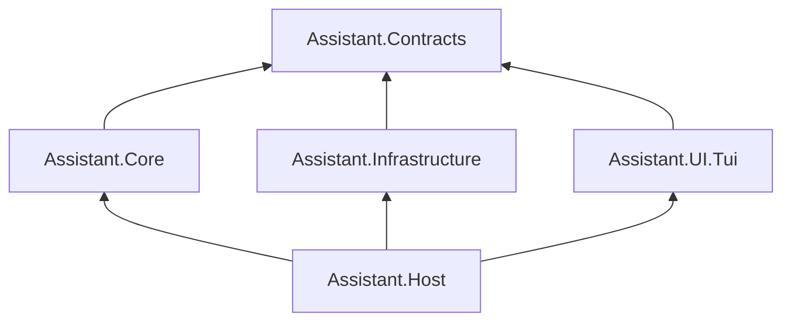

# Системный дизайн Assistant

Как собрать Core (+ референсный TUI) на .NET в одном процессе.  
**Протокол и приёмка** — только [`SPECIFICATION.md`](SPECIFICATION.md). Здесь нет пересказа инвариантов почты/хода: при реализации читать SPEC §§1–3, 5–6.

Этот документ фиксирует структуру, владение, каналы и решения, которые SPEC намеренно не детализирует.  
`src/Assistant.App` — проверка гипотезы: переносим UX-практики, не костыли (см. §11).

---

## 1. Роль документа

| | |
|--|--|
| MUST со спекой | Инварианты Core из SPEC |
| MUST из этого файла | Сборки, границы модулей, слоты, concurrency, persist-очередь, каналы, UI-контракт, stop-list |
| Secondary | Skills, seed, wiki/todo, конкретный TUI IA — точки расширения, не критерий Core |
| Reference-репо | Не источник требований |

Assistant Core = каркас без обязательного Secondary/TUI. Референсный продукт = Core + профиль + TUI.

---

## 2. Цели и не-цели

**Цели:** односторонние зависимости; consumers только на Workspace API + EventBus; протокол в Core, не в UI/LiteDB/Harness; checkpoint + resume; UI и агенты не блокируют друг друга.

**Не-цели:** multi-process/IPC; multi-user/SaaS/OAuth; обязательный MCP; schemaVersion/миграции в Core; hard-stop хода в Core; task-breakdown и код в этом файле.

---

## 3. Стек

| | |
|--|--|
| Runtime | .NET (актуальный LTS/STS на момент реализации) |
| Процесс | Один: Host + Core + Infrastructure + TUI |
| UI (профиль) | Terminal.Gui 2.x |
| Store | LiteDB |
| LLM | OpenAI-compatible HTTP, streaming |
| Host | `Microsoft.Extensions.Hosting` |

Потоки: UI thread (TUI); фоновые ходы и drain persist/event; LLM/tool I/O внутри пуле внутри хода.

---

## 4. Сборки

Дробление Infra на много проектов — не MUST. На горизонт достаточно:

| Сборка | Ответственность |
|--------|-----------------|
| **Contracts** | Порты наружу (store, LLM, FS, Shell, Skills, Approver), `IDirectorWorkspace`, DTO, event records для consumers. Без доменной логики. |
| **Core** | Инварианты + оркестрация: OrgGraph, MailService, Scheduler/машина состояний хода, TurnEngine, tools, SystemAdvisor, EventBus, DirectorWorkspace. Внутри допустимы папки Domain/Application. |
| **Infrastructure** | LiteDB, LLM-клиент, FS/Shell/Skills, AutoApprove. При желании позже разрезать на несколько проектов без смены портов. |
| **Host** | `Program`, DI, конфиг, cold start/restore, wiring. |
| **UI.Tui** | Terminal.Gui, `IUiScheduler`, Log sink. |

**Правила:**

1. Зависимости только вниз.
2. Tui → только Contracts (+ то, что Host отдаёт через DI). Не ссылается на Core/Infrastructure.
3. Infrastructure реализует порты Contracts; не знает Tui; не зависит от типов Core вверх.
4. Store работает документами и стабильными **id** узлов, не live-графом.
5. Toolkit (Terminal.Gui, LiteDB, HTTP) не протекает в чистые инварианты.
6. Внутренние швы Core (mail → scheduler, слоты) **не** обязаны быть в Contracts.

**Имена** компонентов = SPEC §3 (`OrgGraph`, `MailService`, `WakeScheduler`, `TurnEngine`, …).

**Имена vs id:** во внешнем протоколе (почта, tools) — **имена**; в store — стабильные id; резолв на границе MailService/OrgGraph.

---

## 5. Владение состоянием

Не god-object «узел = identity + inbox + session + CTS + SDK». Узкие runtime-контексты хода — внутри Core, не в Contracts/UI.

| Аспект | Владелец |
|--------|----------|
| Identity, дерево | OrgGraph |
| Inbox | MailService |
| Continuity / session хода | TurnEngine (+ persist) |
| Running / слоты / cancel хода | Машина состояний агентов (Scheduler/Turn) |

Инварианты узлов, почты, commit, dispose, wake — **SPEC §2**, здесь не дублируются.

---

## 6. Компоненты Core

Карта как в SPEC §3.1; обязанности — SPEC §3.2. Уточнения дизайна:

| Компонент | Уточнение |
|-----------|-----------|
| **MailService** | Единственная точка мутаций inbox; синхронизация инкапсулирована (lock / semaphore / очередь — деталь реализации). Сигналит машине состояний: wake или mid-turn. |
| **Машина состояний / Scheduler** | CAS одного Running на узел; `MaxConcurrentAgentRuns`; coalesce wake; resume; **слоты** (см. §8). Владеет cancellation токена Running. |
| **TurnEngine** | FSM хода, wake-prompt builder, tool loop, checkpoint в persist-поток, mid-turn inject, CommitContext. |
| **SystemAdvisor** | Stateless hint внутри хода; без tools/session; **без отдельного захвата слота**. |
| **DirectorWorkspace** | Команды Human + DTO + события для UI. В Core, не в Tui. Шаблоны найма — Secondary (опциональный профиль), не обязательная часть Core-API. |
| **EventBus** | Эфемерный fan-out фактов; не апрувы; продьюсеры не ждут UI. |

**Порты в Contracts:** `IDurableStateStore`, LLM, FS, Shell, Skills, `IApprover`, `IEventBus`, `IDirectorWorkspace`.  
Wake/mid-turn — внутренний шов Core, не обязательный контракт наружу.

---

## 7. Четыре канала

Не взаимозаменяемы.

| Канал | Назначение |
|-------|------------|
| **Mail** | Единственная социальная связь узлов (SPEC §2.3–2.4). |
| **EventBus** | Факты для Log/аналитики/реакции UI. Не персистится. |
| **Approver** | Request/response для non-core tools. Не через шину. |
| **DirectorWorkspace** | Командный API Human-consumer’а. |

UI подписывается на события и обновляет представление. В контракте — **DTO/записи событий**, не shared mutable граф Core.

Письмо несуществующему / не addressable → отказ с пояснением.

---

## 8. Слоты и машина состояний

Слоты — ответственность **Core**, встроены в машину состояний агентов.

- Слот = право на один активный ход агента. Лимит: `MaxConcurrentAgentRuns`.
- Агент либо **в процессе (Running)**, либо **простаивает (Idle)**. Отдельного «запланирован / ждёт слот» в модели нет.
- **System** вызывается вложенно в скоупе текущего хода и **переиспользует уже занятый слот**. Отдельного Acquire для System нет (агент и System одновременно не работают).
- **Approver wait** на слот-арифметику не влияет: слот по-прежнему у хода.
- Повторные вызовы System за один ход допустимы (лимита нет — SPEC).
- **Force-dispose / dispose поддерева** — грубая отмена: cancel Running (и inflight System / Approver wait) в ветви; слот отпускается при завершении хода.

Формулировка SPEC про «уступку слота» реализуется именно так: вложенный reuse, не второй захват из пула.

---

## 9. Ход, mid-turn, отмена

Фазы хода, wake-prompt, commit-предикат, tool-список — **SPEC §2.7–2.11, §3.4**.

Уточнения дизайна:

1. Wake только по доставке (не по непустому inbox после Idle).
2. Почта во время Running → **системное оповещение в контекст текущего хода** (inject), не второй ход.
3. Cancellation токена Running владеет машина состояний. Инициаторы отмены: Human force-dispose или агентский dispose ребёнка (с правилами SPEC).
4. Wake-prompt / правила игры собирает TurnEngine; не гигантский standing prompt SDK, расходящийся с wake.
5. Standing instructions — тонкий слой, согласованный с wake.

---

## 10. Persistence

Durable состав и resume — **SPEC §2.13**. Здесь — как устроено в процессе.

**Модель:** поток persist-событий; **один** разгребальщик обрабатывает их **по одному** и пишет в LiteDB. Параллельных писателей в store нет.

Типичные события: изменение графа, операция почты, checkpoint хода (session + флаги), commit continuity, dispose subtree.

- SchemaVersion / миграции не часть Core.
- Битый store → fatal на старте.
- Orphans не prune’ятся; очистка только dispose.
- EventBus / апрувы / UI state не durable.
- Store API: документы + id, не live handles.

Логические коллекции: `nodes`, `mail`, `sessions`, `meta`.

Restore (Host): открыть store → граф и mail без prune → resume узлов с незавершённым ходом → Secondary seed при пустом графе → bus/scheduler → TUI.

*(Нюансы порядка «память vs flush» и редких окон kill между записью и in-process wake — не фиксируются здесь; см. §12.)*

---

## 11. UI (TUI consumer)

IA экранов — SPEC §4 (Secondary). Требования к границе:

1. Команды Director — только `IDirectorWorkspace`.
2. UI реагирует на события (шину / workspace), рисует по DTO.
3. Мутации виджетов — через `IUiScheduler` (UI thread).
4. UI не await’ит ход агента.
5. Log — подписчик шины; coalescing на UI-thread — практика профиля.
6. Approver interactive — через порт Approver (модалка Tui), не через EventBus. Старт профиля может быть AutoApprove.
7. Наблюдаемость deep busy / System — для статуса, не канал управления внуками.
8. Force dispose / operator remove mail — без confirm (выбор референса).

**Переносить из референса как практику:** keyboard-first IA, coalescing log, deepest busy actor, Workspace vs Log.

---

## 12. Конфигурация

| Параметр | Слой |
|----------|------|
| LLM, `MaxConcurrentAgentRuns`, state path | Core |
| Skills / FS / Shell policies | порты + профиль |
| Approver binding | порт + Host |
| Seed / templates / UserDescription | **Secondary** |
| In-app settings UI | не обязателен |

---

## 13. Критерии «архитектура соблюдена»

Дополняет приёмку SPEC §6:

1. Сборки и направления §4; Tui не ссылается на Core/Infrastructure.
2. Нет god-NodeHandle в публичном API; store без live handles.
3. Каналы разделены: Mail / EventBus / Approver / Workspace.
4. Слоты: в машине состояний; System = nested reuse; Approver не в слот-арифметике.
5. Mid-turn = inject в контекст; wake только по доставке.
6. Persist = последовательный разгребальщик событий.
7. Non-core tools через `IApprover`; Secondary можно отключить.
8. Нет Thread/threadId и parentRole.

---

## 14. Не переносить из `src/Assistant.App`

| Антипаттерн | Цель |
|-------------|------|
| Re-wake, если inbox ещё непуст | Wake только по доставке |
| `DeleteMail` как agent tool и «коммуникация» | `ResolveMail` (не коммуникация); Human remove — на Workspace |
| Commit ≈ «mail settled» через delete/dispose | Write/Reply ∨ пустой inbox |
| Prune orphans | Нет |
| System как второй Wait на семафоре / отдельный слот | Nested reuse слота хода |
| Нет порта Approver | Порт обязателен; AutoApprove — binding |
| `parentRole`, `ThreadId` | Нет |
| `NodeHandle` god-object | Разделить владение §5 |
| `AgentBootstrap` как центр всего | Порты + Infrastructure |
| `UserWorkspace` в UI-проекте | `DirectorWorkspace` в Core |
| Один `ILifecycleEventHandler` вместо шины | Multi-subscriber EventBus |
| Persistence от live handles | Документы + id |
| Гигантский standing prompt | Wake-prompt в TurnEngine |
| Single-project monolith | Сборки §4 |

---

## 15. Открыто (не фиксировать в этой версии)

Оставить на отдельную сессию, без догадок в коде «по умолчанию агента»:

- Детали интеграции TurnEngine ↔ LLM (свой loop vs Agents SDK / Harness).
- Точный порядок «мутация in-memory vs enqueue persist» и политика редкого kill между flush и wake-сигналом.
- Закрытый каталог event records и кодов протокольных ошибок.
- Нужно ли дальше дробить Infrastructure на несколько сборок.

---

## 16. Связь документов

| Документ | Роль |
|----------|------|
| [`SPECIFICATION.md`](SPECIFICATION.md) | Протокол и приёмка Core |
| **SYSTEM_DESIGN.md** | Структура, владение, слоты, persist-очередь, каналы, UI-граница, anti-patterns |
| Skills / wiki / todo | Secondary-профиль |

Конфликт: Core-протокол → SPEC; структура модулей → этот файл; тексты skills → файлы на диске (SPEC §7).
